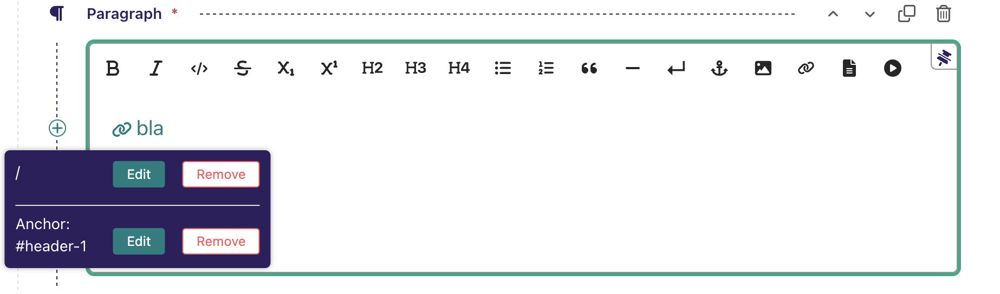

<h1 align="center">Wagtail set</h1>

<p align="center">
<a href="https://pypi.org/project/wagtailset"></a>
<a href="https://pypi.org/project/wagtailset"></a>
<a href="https://pypi.org/project/wagtailset"></a>
<a href="https://github.com/dest81/wagtailset"></a>
<a href="https://pypi.org/project/wagtailset"></a>
<a href="https://github.com/dest81/wagtailset/graphs/contributors"></a>
</p>

<h4 align="center">Wagtail anchors set.</h4>

## Installation

Install using `pip`:

```
pip install wagtailset
```

## Table of Contents

 - [ Wagtail draftail anchors](#wagtailset_draftail_anchors)
 - [ Wagtail draftail anchored internal links](#wagtailset_draftail_anchored_internal_links)

<div id="wagtailset_draftail_anchors" />

## Wagtail Draftail Anchors

Adds the ability to add and edit anchors in the Draftail rich text editor, as well as automatically adding (slug-form) anchor ids to all headings with possibility to changes heading ids. Inspired by [wagtail_draftail_anchors](https://github.com/jacobtoppm/wagtail_draftail_anchors) with some improvements like possibility to edit previous anchor id and headings' ids.


### Instalation

Add `'wagtailset.draftail_anchors'` to `INSTALLED_APPS` below `wagtail.admin`.

Add `'anchor-identifier'` to the features of any rich text field where you have overridden the default feature list.
 **Note:** 'anchor-identifier' must be added before any heading('h1',...,'h6') feature and also before 'link' feature:

```
body = RichTextField(features=['anchor-identifier', 'h2', 'h3', 'bold', 'italic', 'link'])
```


### Rendered representation of anchors

By default, `anchor-identifier` rich text entities will be rendered as HTML `anchor` elements, e.g.:

``` html
<a href="#my-element" id="my-element" data-id="my-element">My element</a>
```


### Configuration

This package provides an alternative renderer that renders `anchor-identifier` entities as HTML `span` elements, e.g.:

``` html
<span id="my-element">My element</span>
```

The desired renderer can be specified using the `DRAFTAIL_ANCHORS_RENDERER` setting. To use the `span` renderer, configure your application as follows:

``` python
DRAFTAIL_ANCHORS_RENDERER = "wagtailset.draftail_anchors.rich_text.render_span"
```

It is possible to define your own renderer. It should be a callable that takes a `dict` of attributes, and returns a string containing the opening tag of the HTML element that represents the anchor target. The `dict` passed to the renderer, for an anchor with an identifier of `"my-anchor"`, would look like the following:

``` python
{"data-id": "my-anchor", "href": "#my-anchor", "id": "my-anchor", "linktype": "my-anchor"}
```

If you define your own renderer, you should set the value of `DRAFTAIL_ANCHORS_RENDERER` to your custom renderer's import path.

See `render_span` and `render_a` in `wagtailset.draftail_anchors.rich_text` for examples.

<div id="wagtailset_draftail_anchored_internal_links" />


## Wagtail Draftail Anchored Internal Links

Adds the ability to add (and edit) anchors to the internal links in the Draftail rich text editor.

### Instalation

Installed by default. No extra configuration needed.


### How it works

**Add anchor to the internal link:**


**Edit anchor of the internal link:**



### Rendered representation of anchors

By default, `link` rich text entities will be rendered as HTML with anchor in the end if it is set, e.g.:

**Database representation:**
``` html
<a hash="header-1" id="3" linktype="page">bla</a>
```

**HTML representation:**
``` html
<a href="/page3/#header-1">bla</a>
```
